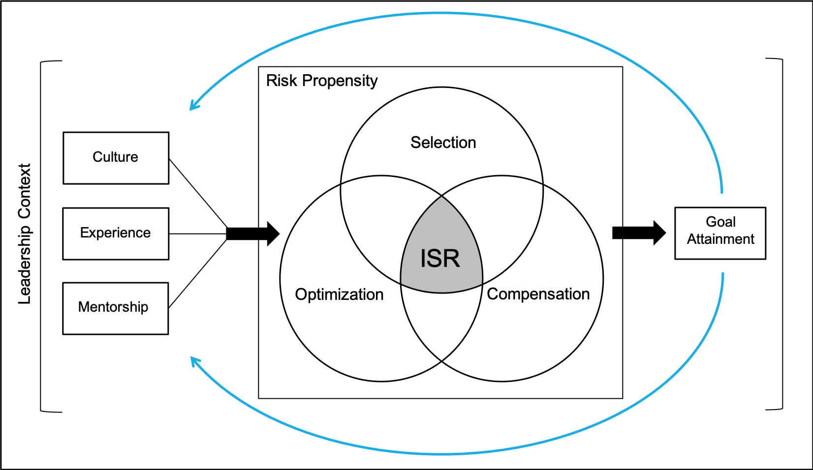

```{r setup, include = FALSE}
library("papaja")
knitr::opts_chunk$set(echo = FALSE, warning = FALSE, message = FALSE)
r_refs(file = "r-references.bib")
```

On the darkest of nights, a young military leader was faced with a series of choices that would not only determine if the late-night mission was successful but also if these choices would determine whether the Soldiers under his command could potentially live or die. As the ramp of the cargo aircraft opened, the subzero temperatures filled the cargo area. The Soldiers knew they needed oxygen to breathe at this altitude, and the oxygen bottles strapped to their harnesses were running low. The young leader weighed many goals and factors as he decided whether to make the high altitude jump into enemy territory or have the aircraft turn around and safely return to base. The goals of the mission became increasingly conflicting. On the one hand, the immediate safety of those in the aircraft seemed paramount. However, on the other, the safety of those men already rapidly walking toward the enemy-held compound relied on these airborne Soldiers isolating the compound first. Numerous factors weighed on the decision to execute or abort the mission. 

An individual's goal hierarchy informs priorities and provides a framework for these decisions. If the superordinate goal is mission accomplishment, then the leader may choose to execute the mission even if it is inherently risky for his Soldiers. However, if the lives of his Soldiers are the superordinate goal, then the leader will make decisions and align resources to optimize the health of the Soldiers over the execution of the mission. Given perfect information, this decision could be made based on the established goal hierarchy. No decision is made in isolation, void of all context and biases. Instead, goal-based decisions and goal-directed behavior is deeply embedded in an individual's context as much as it is in the life-experiences of the individual. Contemporary developmental scientists have sought to describe, explain, and optimize this decision making process and the operationalization of the goal-directed behavior (termed intentional self-regulation) across the life span. A person's ability to regulate their relationships with their complex and everchanging context is the fundamental basis for successful development across an individual's life [@baltes1999]. Unfortunately, goal-based decisions are often difficult due to imperfect information and fuzzy logic^[This term is popularized in modern computing applications which is based on "degrees of truth" rather than "right/wrong" or "true/false" (https://searchenterpriseai.techtarget.com/definition/fuzzy-logic). Fuzzy logic more closely mirrors how human's make decisions compared to boolean logic.], summarized well by the military idiom, "mission first, men always." 

In the leadership context, leaders often make goal-based decisions that rely on imperfect and, at times, missing information. Decisions are easy when a clear right or wrong can be established. However, decisions become exponentially more difficult when full information is not available. Would the oxygen bottles run out before the Soldiers could safely reach the ground? Would the enemy be alerted to the aircraft and train their weapons on the vulnerable Soldiers under parachute? Would the Soldiers be able to land and consolidate on the postage stamp size drop zone in the rugged mountain hills? Did the Soldiers have adequate training to conduct this operation successfully? The outcome of this decision would determine the well-being of the Soldiers this young officer leads and his future professional trajectory. These questions all rely on risk-based probabilities that are informed by prior experience, the culture of the organization, the mentorship of experienced Soldiers, and a little bit of luck^[The moment preparation meets opportunity.].  Decision-making researchers describe this process as *naturalistic decision-making*, in an attempt to capture how individuals use their experience to make decisions [@lipshitz2001].

This paper will build upon an existing intentional self-regulation theory to incorporate recent advances in the decision-making literature, specifically, the contribution that uncertainty and risk may have on life-span goal-directed behavior. I will begin the discussion with the developmental theories of intentional self-regulation, briefly describe the current state of decision-making literature and the risk-taking research, and then turn to a proposed integrated developmental model that better captures naturalistic intentional self-regulation in contexts that are seated in risk and uncertainty. 

# Intentional Self-Regulation

Intentional self-regulation is considered a fundamental process of human functioning [@bowers2011] and describes a life-span model of behavior that leads to positive outcomes. Intentional self-regulation can be defined as an "individual's chosen, organized action-in-context that further self-defined, valued goals or purposes" [@napolitano2011]. The intentional self-regulation process helps an individual navigate successful coactions with their environment to achieve stated goals. The construct of goal-directed behavior is well described in the German action theory literature [@frese1994]. Action theory is situated within the developmental systems metatheory describing goal-directed behavior through the lens of a person $\longleftrightarrow$ context relation [@fischer2006; @mascolo2015; @overton2015a]. That is, neither the person nor the context acts independently. Instead, the goal-directed behavior of an individual acts on the context, and the context acts on the individual in a mutually influential manner. Three general models of intentional self-regulation currently exist within the developmental literature [@lerner2018; @lerner2002; see also @gestsdottir2005].  

The motivational theory of life-span development builds upon the life-span theory of control and the action phase model of developmental regulation to address the control processes involved in goal engagement and goal disengagement [@heckhausen1995; @heckhausen2010]. The theory posits two forms of control that exist in goal-directed self-regulation. The primary control process describes the extent to which the individual realizes control over his or her context [@heckhausen2010]. In other words, primary control is the process wherein individuals change the context to bring the context in line with the individual's goals [@rothbaum1982]. This process is an assimilation one [@brandtstadter1998; @brandtstadter2006; @piaget1970]. Secondary control is the process by which individuals change themselves to bring themselves in line with the context. This process reflect accomodation [@brandtstadter1998; @brandtstadter2006; @piaget1970]. Overall, the model describes an individual's motivational system to maximize primary control across life domains [@heckhausen2010] through a sequential process of goal selection, goal engagement, and goal disengagement.

The second theory of intentional self-regulation is commonly referred to as the tenacious goal pursuit and flexible goal adjustment (TENFLEX) model [@brandtstadter1998; @brandtstadter2006; @brandtstadter1990]. The TENFLEX model describes the assimilation process (similar to primary control) as the individual transforming the circumstances to align with personal preferences and the accommodation process (similar to secondary control) as adjusting personal preferences to situational constraints [@brandtstadter1990]. According to this model, individuals strive to achieve a subjectively favorable balance of gains and losses across the life span [@brandtstadter1989].This balance reflects the equilibration process discussed by Piaget [-@piaget1970].

The third framework was described by Baltes and Baltes [-@baltes1990] and involved a theory of life-span development through the Selection and Optimization with Compensation Model (SOC). The SOC model was initially theorized to describe a universal life management strategy for successful aging and has been adapted to focus on specific contexts, including the workplace [@baltes2001; @wiese2000], and child and adolescent development [@gestsdottir2007; @lerner2001a]. The SOC model is comprised of three processes of developmental regulation. *Selection* refers to setting goals and encompasses the specification of goals, establishing a hierarchy of goals, and a commitment toward goals. A subset of selection is *loss-based selection*, that is, adjusting goals as one ages and resources are no longer available to achieve established goals (such as health) [@freund2002]. *Optimization* refers to the acquisition and investment of goal-related means and encompasses focus, persistence, resource allocation, modeling others, and acquiring new skills, such as executive functioning or strategic thinking [@freund2002; @lerner2018]. *Compensation* refers to acquiring alternative means to achieve goals and encompasses substitution of means, enlisting the help of others, activation of unused skills or acquiring new skills, and changes in allocation [@freund2002].

These three models have significant overlap theoretically [@haase2013] and generally describe two similar processes. Each of the three models describes a process wherein an individual exerts control or influence over the context to achieve a goal. Heckhausen [-@heckhausen2010] describes this process as primary control, Brandstadter [-@brandtstadter1990] describes this as assimilation, and Baltes [-@baltes1990] describes this as Selection, Optimization, and, Compensation. Each of the three models also describes a process wherein an individual must adapt to contextual constraints by adjusting goals. As these are all life-span development theories, initially created to describe positive adaptation as an individual ages, contextual constraints within this literature generally refer to the loss of capabilities later in life. Heckhausen [-@heckhausen2010] describes this process as secondary control, Brandstadter [-@brandtstadter1990] describes this as accommodation, and Baltes [-@baltes1990] describes this as loss based selection. 

All three of the action-theory models have been applied toward adult development contexts. However, only the SOC model (minus loss based selection) has been empirically associated with positive outcomes in child, adolescent, and adult development contexts [@gestsdottir2007; @lerner2001a; @lerner2002; @wiese2000]. In the leadership context, the SOC model may be more useful as the assimilation, and secondary control processes fall short of describing the need for leaders to adapt approaches toward accomplishing established goals and instead focus more specifically on loss-based selection processes or mental processes of acceptance when goals are not achieved. In particular, the military leadership context does not support a leader that fails to accomplish a mission and develops an attitude of "it really wasn't worth it anyway," which might be a stance taken when using accommodating processes (secondary control or flexible goal adjustment).

The SOC model also mirrors much of the U.S. Army's military decision-making process (MDMP). Upon receipt of a mission/goal, the MDMP is meant to objectively weigh and assess different courses of action based on mathematically-based decision criteria to optimize available resources in the accomplishment of the stated mission/goal. Once a plan is established, a process of 'contingency' planning is conducted to determine alternate approaches toward goal accomplishment if resources become unavailable [@call2015]. This process of goal selection, the optimization of resources, and planning for the compensation of available means follow the general SOC framework of goal-directed behavior.

Both the SOC model and the MDMP are objective models and do not quantify the probabilistic nature of goal-directed decisions in a context where full information is not available. In reality, goal-directed decisions and behaviors are employed in both times of certainty and uncertainty. Uncertainty implies that there is only a probability less than 100% certainty of achieving a goal. The less information available when establishing a goal and plan of action, the less likely it will be guaranteed that the stated outcome will be achieved. A level of uncertainty underlies every decision that is made in naturalistic settings, as a person does not act in a vacuum but instead acts in an everchanging person $\longleftrightarrow$ context relation. To better understand how uncertainty can be quantified, it is useful to discuss the current decision-making literature.

# Decision Making 

Advances in decision-making research may provide insight into uncertainty and intentional self-regulation. The early models of decision-making, referred to as classical decision-making, involved a deliberate process that required thorough information to choose the best option between all available alternatives but followed a formal, context-free process [@lipshitz2001]. MDMP is a concrete example of classical decision-making. When synchronizing hundreds of resources on a battlefield, MDMP does provide a formal integration and alignment towards common objectives. By following MDMP, leaders essentially remove their subjective (experienced based) knowledge from the process to conform to the formal process. Practically, however, aspects of this model are often ignored in favor of the commander's directed courses of action. The decision-making researchers would refer to this subjective, experience-based approach as a naturalistic decision-making process.

During the 1990s, naturalistic decision-making grew in prominence to capture how contexts influenced decision-making [@orasanu1993]. The naturalistic decision-making model eventually shifted focus from the context in which decisions are made to the way people use their experience to make decisions [@zsambok2014]. The shift in focus toward the individual, modeled decision-making as matching a decision to the context, and not merely making a context-free choice [@lipshitz2001].

In naturalistic decision-making research, risk is associated with uncertainty and error. The more uncertainty that exists when making decisions, the higher the probability of making an error, and the higher risk that is involved. Numerous coping strategies exist to reduce uncertainty; however, the more context-specific experience a decision-maker has, the more ability they have to anticipate problems ahead of time and to judge when to continue with a specific plan, or prudently adjust the plan based on their previous experiences [@lipshitz2001]. The naturalistic decision-making research literature suggests that experience plays a crucial role in goal-directed decisions under risky/uncertain contexts, and may inform how individuals decide on long-term goals and resource allocation, which is abundant in uncertainty [@klein2008; @zsambok2014].

As a developmental construct, intentional self-regulation provides a universal process that informs a person's goal-directed behavior throughout their life span. However, the specificity principle suggests that developmental scientists should consider that specific people make specific decisions about specific goals in specific contexts for specific reasons [@bornstein2017a; @bornstein2019]. The current SOC model represents a more *classical* goal-directed behavior model. However, in naturalistic settings, the universality of the SOC process does not explicitly consider how an individual assumes, mitigates, and accounts for the inherent risk of making goal-based decisions when full information is not available. 

Consider two individuals, each with identical levels of defined and classically-assessed intentional self-regulation. Both individuals adequately select goals, optimize their resources to achieve those goals, and compensate when goal-based means are no longer available. Even with full information, it would be unlikely that both individuals would choose the same goals and align the same resources toward goal accomplishment even in the same specific context. The specificity principle and the idea of naturalistic intentional self-regulation combine to suggest that interindividual differences will be evident. These interindividual differences would be further highlighted when full information is not available. To account for this variation, developmental scientists must also consider each person's specific history of experiences within this type of context; willingness to assume risk in goal selection, resource allocation, and compensation. In addition to an individual's appraisal of the uncertainty and risk. 

An individual's intuition or "gut feeling" plays a substantial role in decisions [@sadler2004]. Intuition refers to the assumptions that are formed based on past experiences, successes, failures, and retrospective analysis, or more broadly, the cumulative knowledge that an individual gains as they mature. The fuzzy-trace theory literature posits that as humans develop and gain life-experience, they rely more on intuition to make decisions than on a concrete formal conscious thought process [@brainerd1990; @reyna2011]. Intuition, or the assumptions we make based on the sum of our life experiences and knowledge, may help explain naturalistic decision making and frame why interindividual differences would exist in goal-directed behaviors. Intuition is especially important as we think about ISR across the life-span.

An individual's intentional self-regulation is critical to navigating successful coactions with their context during times of certainty, such as conducting daily or weekly chores, and perhaps more importantly, during times of uncertainty, such as changing jobs, moving, economic recessions, and global pandemics. Intuition may help frame how lived experiences contribute to interindividual differences and possibly intraindividual development; however, not all uncertainty is equivalent. Thinking back to the opening of this paper, researchers can imagine that qualitatively different processes are employed when decision-makers face the uncertainty that cannot result in personal harm or loss of livelihood and uncertainty where behaviors could lead to harm or a person's demise. In an *in-extremis* context, that is when lives are on the line, risk-taking research may provide some important additional contributions to intentional self-regulation theory and how intuition may be observed in this context.

# Risk-Taking 

Risk-taking is abundantly mentioned in the neuroscience, decision making science, and risk research fields [e.g., @peterman1999; @renn1998; @steinberg2010; @taylor-gooby2006]. A recent meta-analysis in the *Journal of Risk Research* provides a useful description and definition for the four core concepts that exist in the current risk literature [@bran2019]. The first is risk-taking behavior, which is the behavioral actions a person takes involving risk. The second is risk-taking propensity, which refers to the consistent tendency of a person to engage in risk-taking behaviors. The third is risk-taking attitude, which refers to the risk preference or the extent to which a person favors risky choices. The final concept is risk appraisal, which is the subjective assessment of riskiness [@bran2019]. 

Empirical studies suggest both a global factor of risk-taking propensity among adolescents [@duell2019; @veliz2015] and a more context-specific risk-taking propensity [@horvath1993] among individuals; this contextual specificity suggests that a person may show higher risk-taking propensity in some contexts compared to others. These findings also suggest that risk-taking, as it pertains to intentional self-regulation, may be both global (some individuals are more likely to make riskier decisions overall) and context-specific (some individuals are only more likely to make riskier decisions in specific contexts). Existing research also suggests increases in risk-taking propensity in high-stress environments [@sicard2001], following violent combat experiences [@killgore2008], and with higher levels of perceived self-efficacy [@krueger1994]. 
    
Research on risk-taking attitude is equally conflicting, suggesting that the appeal of risky situations may relate to the management and minimization of the risk involved [@paquette2009] and not to the riskiness of the situation itself. Attitudes toward risk are most certainly grounded in culture and can be influenced by the context [@crenshaw2013]. For example, leaders that are willing to expose themselves to potentially life-threatening situations are more effective [@frost1983] and thus would have more favorable attitudes toward risk-taking. 

Risk appraisal is perhaps the most interesting concept in risk-taking literature. Risk by its nature is subjective. The same action can be considered risky for one person but safe for another depending on experience, training, and personal situations [@bran2019]. Skydiving is an excellent example of this subjectivity. If experienced skydivers perceived the same level of risk in this hobby as someone that has never stepped out of an aircraft while it was in flight, skydivers would be less likely (maybe unwilling) to conduct this activity [@bran2019]. However, the years of training and experience may influence the risk appraisal of the skydivers. Risk appraisal may be an important aspect to consider when thinking about how previous experiences influence an individual's intentional self-regulation.

Risk-taking is a complex construct that should be carefully considered through a theoretical lens that focuses on the dynamics of individual $\longleftrightarrow$ context relations [e.g., @mascolo2015], such as models from relational developmental systems metatheory [@overton2015a]. How an individual assesses risk and makes risky decisions cannot be reduced to any one of these core concepts without considering how the four concepts coact and, more importantly, the person $\longleftrightarrow$ context relation. For example, consider novice and experienced skydivers. Each group performs the same act; however, experience and training may contribute to an experienced skydiver assessing the risk as lower than the novice skydiver. As a result, the experience an individual has with a task may lead to interindividual differences in risk appraisal, risk propensity, and the actual amount of physical risk involved, even when considering the same task at the same point in time.

An individual's life experience plays an essential role in intentional self-regulation, especially in contexts where risk-taking is a professional necessity. In order to understand the potentially idiographic character of a specific person's intentional self-regulation, an individual's lived experience, risk-taking propensity, risk appraisal, and culture must be included.

# Naturalistic Intentional Self-Regulation

Conceptually, the proposed model, which is presented in Figure\ \@ref(fig:model), begins with a specific person in a specific context. Lived experiences, risk-taking (propensity and appraisal), mentorship, and culture would moderate the loftiness of the goals selected, the accumulation of available resources, the persistence of behaviors toward the stated goals, and determine when compensation processes should be enacted. The success or failure of the goal-directed behavior would then act in a circular nature to inform future goal-directed behavior. The model depicts the person $\longleftrightarrow$ context relation.  

To test this model within the military leadership context, measures of intentional self-regulation, self-reported risk-taking appraisal, and propensity, behavioral indicators of risk-taking, lived experiences, and organizationally important outcomes would need to be collected to determine if and how risk and experiences moderate the association of ISR with positive outcomes. Additional contextual variables (mentorship and culture) would need to be thoroughly understood. 

West Point provides a unique context where data exist for each of these contexts. If the model is supported, the model would then need to be tested across similar contexts (perhaps the Air Force Academy or the Naval Academy) before it can be tested across broader contexts (e.g., first responders, health care workers). 

# Conclusions

Several years ago, high above the mountainous landscape, it was the training, experience, council, and culture that informed my goal-directed behavior and decision-making process. After issuing the execution order and watching my well-trained Soldiers disappear into the midnight abyss, I confidently stepped out of the aircraft, one step closer to accomplishing our mission. Now, as a developmental scientist, I am grappling to understand the processes that make some individuals more positively adaptive than others in leadership contexts. I want to understand why I made life-altering decisions throughout my military career so that I can better prepare future leaders to be optimally equipped to make appropriate decisions. 

The integration of research by developmental scientists, risk-taking scientists, and decision-making scientists, provides a lens to understand these processes better. Future research is needed to determine if lived experience moderates risk-taking propensity and risk appraisal, whether risk-taking moderates the positive contributions that intentional self-regulation has on successful adaptation throughout the life-course, and if risk-taking does moderate intentional self-regulation, how can this moderation be optimized throughout life span development.

\newpage

(ref:model) Theoretical Model

**Figure\ \@ref(fig:model)**

*The Naturalistic Model of Selection Optimization Compensation in a Leadership Context.*
```{r model, fig.cap = "(ref:model)", out.width = "75%"}

```
*Note.* While simplistic, this model displays how a specific context (culture, previous experiences, and guidance/mentorship) influences a specific individual's risk-taking propensity and goal-directed behavior, which in turn influences the context in a reciprocal manner.

\newpage

Adjustments to be made in the word version:
- add these lines after name: 

In partial fulfillment of the requirements for the degree of 
Doctor of Philosophy 
Child Study and Human Development 

- Add Author Note
- Add this to author note:

 I would like to thank my advisors, Dr. Richard M. Lerner and Dr. Sara K. Johnson for their guidance, help, and direction in the process of crafting this paper.  

- Bold title on title page
- author note- bold and title case the "N"ote
- Add wordcount
- Create new page after abstract, key words, and wordcount
- Bold title on first page
- Place figures after references
- Make Figure bold
- Adjust line spacing for figure and title

\newpage

# References


