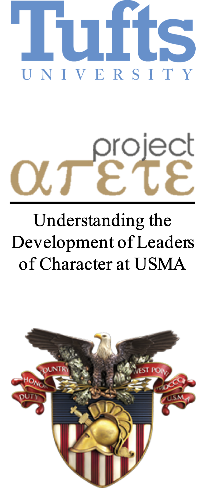

```{r setup, include=FALSE}
knitr::opts_chunk$set(
	echo = FALSE,
	message = FALSE,
	warning = FALSE
)
knitr::opts_chunk$set(message = FALSE)
knitr::opts_chunk$set(warning = FALSE)
options(htmltools.dir.version = FALSE)

# Function to add colored text to the document

colorize <- function(x, color) {
  if (knitr::is_latex_output()) {
    sprintf("\\textcolor{%s}{%s}", color, x)
  } else if (knitr::is_html_output()) {
    sprintf("<span style='color: %s;'>%s</span>", color, 
      x)
  } else x
}
```

name: title_slide
class: inverse, center, top
background-image: url("img/tufts.png")
background-size: 90%
background-position: 50% 43%

```{r xaringanExtra}
xaringanExtra::use_logo(
  image_url = "img/hexlogo.png",
  link_url = "https://andrewfarina.com",
  width = "65px",
  height = "75px",
)
```

## <u>Risk-Taking and Goal-Directed Behavior:</u>
### *How risk and decision-making science can inform <br> intentional self-regulation theory*
<br><br><br><br><br><br>
### Andrew Farina | EP Summer Series | 27 July 2020<br>`r colorize("Advisers: Dr. Richard M. Lerner | Dr. Sara K. Johnson", "grey")`
`r icon::fa("github")` [github/A-Farina](https://github/A-Farina)<br>
`r icon::fa("twitter")` [AndrewFarina01](https://twitter.com/AndrewFarina01)<br>
`r icon::fa("envelope")` [andrew.farina@tufts.edu](mailto:andrew.farina@tufts.edu)<br><br>
Slides Available at <https://andrewfarina.com/slides/xxx>

---
name: overview
class: inverse, left, top

## <u>Overview</u>
- ### What led me here

--

- ### An example to frame the discussion

--

- ### Literature: `r colorize("&nbsp;&nbsp;&nbsp;&nbsp;&nbsp;&nbsp; ISR &nbsp; | &nbsp; Decision Making &nbsp; | &nbsp; Risk-Taking", "lightgreen")`

--

- ### A proposed conceptual model

--

- ### A plan to test the Model

--

- ### Discussion

---
name: introduction
class: inverse, left, top

# What led me here?
--


???
- Grew up in a small town in NH.

--


???
- Went to West Point (first to graduate college in my family)

--


???
- I have spent over four years deployed, working through long term planning with other cultures

--


???
- Went back to West Point to teach leadership- organizational emphasis on character development

--

<br><br><br><br><br><br><br><br><br>

???
- In the Child Study Human Development program- natural fit given project Arete
- Discussing research areas with Rich- Leadership, "what has made you successful", humility and self-regulation
- Started learning about ISR, and one day had a conversation with Hillary about risk "kind of being the opposite of ISR"
- I would consider myself to be good at goal-directed behavior...but am I also risky? maybe, maybe not...it depends.
- access to Cadets (well studied population)

--


--


--


--


--


---
name: example
background-image: url("img/halo.png")
background-size: contain
class: inverse, left, top

# Imagine for a second...

.footnote[
`r colorize("Image created by Stuart Brown, https://skipperpress.com/portfolio/gallery-prints/halo-night-insertion/", "red")`
]

???

- Describe in detail the jump example to set up the talk. Focus primarily on decision making (goal directed behavior), the many unknowns that exist making the decision very hard to do.

---
name: isr
background-image: url("img/isr2.png")
background-size: 30%
background-position: 80% 50%
class: left, top
##<u>Intentional Self-Regulation:</u>

.left-column[
- ### Selection
- ### Optimization
- ### Compensation
]

.footnote[
Baltes, P. B., & Baltes, M. M. (1990). Successful Aging: Perspectives from the Behavioral Sciences. Cambridge University Press. 
]

???

- Describe ISR- where it came from (German Action Theory), and why it is interesting (4H study)
- ISR is the coordinated integration of these three processes. 
- ISR itself is not enough to describe intraindividual differences between person A and person B...largely because of the "unknown", or never having 100% of the information. Use 

---
name: decision_making
background-image: url("img/isr2.png")
background-size:30%
background-position: 80% 50%
class: left, top
##<u>Decision Making:</u>

 .left-column[
* ### Classical <br> Decision Making<br><br>
* ### Naturalistic <br> Decision Making
]

.footnote[
Klein, G. (2008). Naturalistic Decision Making. Human Factors, 50(3), 456–460.<br>
Sadler-Smith, E., & Shefy, E. (2004). The intuitive executive: Understanding and applying ‘gut feel’in decision-making. Academy of<br>&nbsp;&nbsp;&nbsp;&nbsp; Management Perspectives, 18(4), 76–91.<br>
Matzler, K., & Bailom, F. (n.d.). Despite the welter of data and analytics at their disposal, experienced managers often need to rely on gut instinct<br>&nbsp;&nbsp;&nbsp;&nbsp; to make complex decisions under duress. 5.
]

???

- Define Classical Decision Making and how ISR (SOC) falls into this category for the most part.
- Define Naturalistic Decision Making and how context needs to be considered to understand why someone makes a decision.

--

background-image: url("img/dm.png")
background-size:65%
background-position: 95% 50%

???
Describe evolution of decision making from classical to naturalistic
- go back to how ISR is viewed (context general)
- may be a good way to describe context specific ISR
---
name: risk
background-image: url("img/dm.png")
background-size:65%
background-position: 95% 50%
class: left, top
##<u>Risk Taking:</u>

 .left-column[
* ### Propensity<br> 
* ### Appraisal<br> 
* ### Behavior<br> 
* ### Attitude
]

.footnote[
Bran, A., & Vaidis, D. C. (2019). Assessing risk-taking: What to measure and how to measure it. Journal of Risk Research, 0(0), 1–14.
]

--

background-image: url("img/risk.png")
background-size:65%
background-position: 95% 50%

???

Describe nuances of risk-taking
- describe each of these four areas and how we're learning more about them...
- go back to the example
---
name: model
background-image: url("img/model.png")
background-size:80%
background-position: 50% 75%
class: left, top
##<u>Conceptual Model</u>

???
Describe model
---
name: testing
background-image: url("img/model.png")
background-size:80%
background-position: 50% 75%
class: left, top
##<u>Testing the Model</u>

???
Describe the SOC measure
Describe the Risk measure
---
name: discussion
class: inverse, top, left
<br><br><br><br><br><br><br>
## What are your thoughts at this point?

.footnote[
### `r colorize("I want to thank my advisers (Rich and Sara) for their mentorship, feedback, and patience while I developed this model and the department for letting me present this and learn from you.", "green")`
]